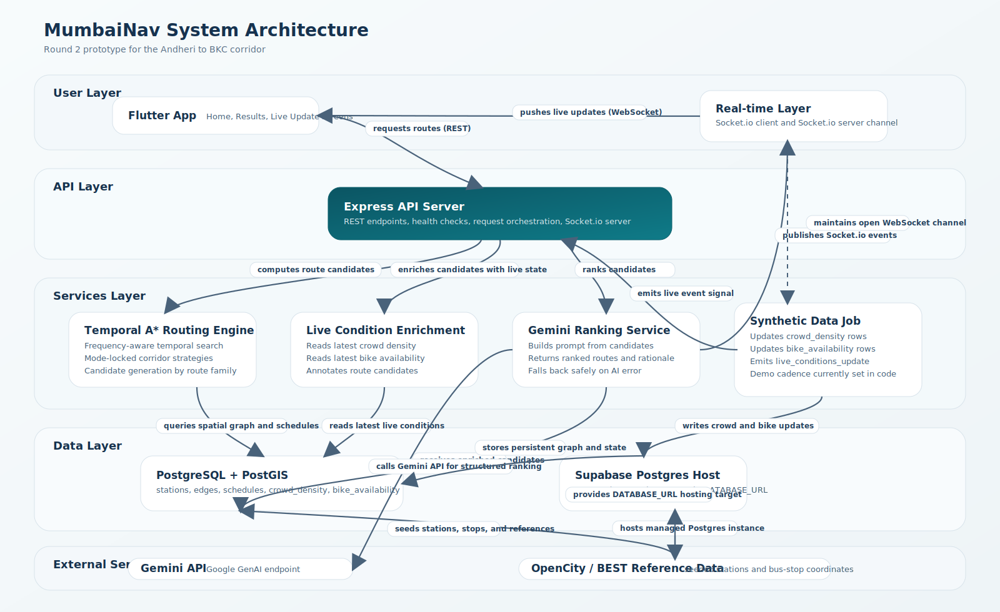

# MumbaiNav

## Header

A multi-modal routing prototype with temporal A*, AI-assisted ranking, and live condition refresh.


## Overview

MumbaiNav is a corridor-scale, multi-modal commuter routing in Mumbai. The current implementation focuses on the Andheri -> BKC journey (planned to scale) and combines:

- A temporal A* routing engine over a small spatial graph
- Mode-locked candidate generation across rail, bus, bike, and walk legs
- Gemini 2.5 Flash to rank candidate routes using live crowd and bike signals
- Socket.io-powered live refresh so the mobile UI can react to changing conditions

The problem it solves is not just "find the shortest path." In this corridor, the best route depends on transfer structure, service frequency, live crowding, and whether a last-mile bike option is actually usable. MumbaiNav turns those tradeoffs into a ranked set of commuter-friendly options.

## Features

- Temporal A* search over a PostGIS-backed graph with time-sensitive wait costs.
- Four explicit corridor strategies: `via_bandra_bus`, `via_bandra_bike`, `via_kurla_bus`, and `via_kurla_bike`.
- Real-time enrichment of candidate routes using synthetic crowd density and bike dock availability.
- Gemini-based re-ranking with structured JSON output and per-route reasoning.
- Express REST API for raw, direct, and AI-ranked route retrieval.
- Socket.io event delivery for live condition updates to the Flutter app.
- Supabase-compatible PostgreSQL connection flow for hosted development.
- Offline script coverage for routing and AI-ranking logic in the backend.

## Tech Stack

| Layer | Technologies | Notes |
| --- | --- | --- |
| Mobile app | Flutter, Dart | Results and live update UI |
| API server | Node.js, Express, CORS, dotenv | REST endpoints plus health checks |
| Real-time transport | Socket.io, socket_io_client | Pushes `live_conditions_update` events |
| Routing engine | Custom temporal A* in JavaScript | Frequency-aware wait-time modeling |
| AI layer | `@google/genai`, Gemini 2.5 Flash | Ranks candidates and explains top pick |
| Database | PostgreSQL(Hosted on Supabase), PostGIS | Stations, edges, schedules, crowd, bike tables |
| Hosting model | Supabase-compatible Postgres connection string | Referenced in `.env.example` and `db.js` |
| Test utilities | Node scripts | Offline routing and AI-ranking validation |

## Architecture

MumbaiNav uses a mobile client + API server split. The Flutter app retrieves route candidates over REST, subscribes to live condition events over Socket.io, and re-fetches ranked routes when conditions change. The backend owns route search, live-condition enrichment, AI ranking, and synthetic update generation.



Architecture highlights:

- Flutter is the only user-facing runtime.
- Express is the orchestration layer between routing, live enrichment, AI ranking, and the database.
- PostGIS stores the corridor graph and simulated live state.
- Synthetic data updates are used for demo realism and repeatability.
- Gemini is advisory, not authoritative: route generation still comes from deterministic backend logic.

## Routing Engine

The routing core is a temporal A* implementation in [`api/src/services/routingEngine.js`](./api/src/services/routingEngine.js).

Key design choices:

- Heuristic: straight-line haversine distance converted into seconds using a capped speed assumption.
- Cost model: `wait_seconds + travel_seconds` for each traversed edge.
- Wait estimation: derived from `schedules.frequency_minutes`, with time-of-day bands.
- Graph restriction: each strategy is executed on a restricted subgraph rather than a single unconstrained search.
- Candidate generation: the engine enumerates corridor-safe strategies first, then computes the best path within each one.

## AI Integration

Gemini 2.5 Flash is used in [`api/src/services/aiRanking.js`](./api/src/services/aiRanking.js) to rank already-computed route candidates.

What the AI does:

- receives candidate summaries including ETA, last-mile mode, crowd density, and bike availability
- ranks all route IDs from best to worst
- provides one-sentence reasoning per route
- returns a `top_choice_reason` explaining why the top route beat the alternatives

What the AI does not do:

- it does not generate routes from scratch
- it does not query the database directly
- it does not replace deterministic routing logic

This keeps the system production-aware: routing is explainable and reproducible even if the AI layer fails. In `/route/smart`, AI errors are caught and returned alongside raw candidates instead of taking down the request.

## Real-time Layer

The real-time loop is implemented with Socket.io.

Flow:

1. The backend synthetic data job updates crowd density and bike availability.
2. After each tick, the backend emits `live_conditions_update`.
3. The Flutter live screen listens for the event.
4. On receipt, the app re-calls `RouteService.fetchRoutes(...)`.
5. The refreshed `/route/smart` response already includes the newest DB state and fresh Gemini reasoning.

Relevant files:

- [`api/src/server.js`](./api/src/server.js)
- [`api/src/jobs/syntheticDataJob.js`](./api/src/jobs/syntheticDataJob.js)
- [`frontend/lib/services/route_service.dart`](./frontend/lib/services/route_service.dart)
- [`frontend/lib/screens/live_update_screen.dart`](./frontend/lib/screens/live_update_screen.dart)

## Data Sources

MumbaiNav currently mixes real reference geometry with synthetic operational signals.

Real or reference-derived inputs:

- Train station coordinates seeded as OpenCity reference data
- Bus stop coordinates seeded as OpenCity / BEST reference data
- Spatial graph structure stored in PostgreSQL/PostGIS

Synthetic or modeled inputs:

- Bike dock placements
- Crowd density values
- Bike availability values
- Frequency bands used as service approximations rather than official GTFS schedules

## Project Structure

```text
MumbaiNav/
|-- README.md
|-- architecture.svg
|-- api/
|   |-- package.json
|   |-- .env.example
|   |-- db/
|   |   |-- schema.sql
|   |   `-- seed/
|   |-- scripts/
|   |   |-- test-routing-offline.js
|   |   |-- test-ai-ranking-offline.js
|   |   `-- test-socket-client.js
|   `-- src/
|       |-- server.js
|       |-- db.js
|       |-- jobs/
|       |   `-- syntheticDataJob.js
|       |-- routes/
|       |   `-- route.js
|       `-- services/
|           |-- routingEngine.js
|           |-- liveConditions.js
|           |-- aiRanking.js
|           |-- crowdDensityGenerator.js
|           `-- bikeAvailabilityGenerator.js
`-- frontend/
    |-- pubspec.yaml
    `-- lib/
        |-- main.dart
        |-- data/
        |-- models/
        |-- screens/
        |-- services/
        |-- theme/
        |-- utils/
        `-- widgets/
```

## Setup & Installation

### Prerequisites

- Node.js 20+ recommended
- npm
- Flutter SDK 3.x
- PostgreSQL with PostGIS enabled, or a Supabase Postgres instance
- Gemini API key

### 1. Clone the repository

```bash
git clone https://github.com/Dev-Am12/MumbaiNav.git
cd MumbaiNav
```

### 2. Configure the backend environment

```bash
cd api
cp .env.example .env
```

Populate:

- `DATABASE_URL`
- `PORT`
- `GEMINI_API_KEY`
- optional `GEMINI_MODEL`

Example `DATABASE_URL` pattern:

```env
DATABASE_URL=postgresql://postgres:[YOUR-PASSWORD]@[YOUR-PROJECT-REF].supabase.co:5432/postgres
```

### 3. Install backend dependencies

```bash
npm install
```

### 4. Initialize the database

Run the schema and seed files in order:

```bash
psql "$DATABASE_URL" -f db/schema.sql
psql "$DATABASE_URL" -f db/seed/01_stations.sql
psql "$DATABASE_URL" -f db/seed/02_dadar_and_edges.sql
psql "$DATABASE_URL" -f db/seed/03_schedules.sql
psql "$DATABASE_URL" -f db/seed/04_bkc_internal_walks.sql
```

### 5. Start the backend

```bash
npm start
```

The API listens on `http://localhost:4000` by default.

### 6. Configure the Flutter frontend

In a second terminal:

```bash
cd frontend
flutter pub get
```

The current frontend supports a runtime base URL override:

```bash
flutter run --dart-define=MUMBAINAV_API_BASE_URL=http://<YOUR_LOCAL_IP>:4000
```

If omitted, the code currently falls back to the hard-coded LAN demo URL in `route_service.dart`.

### 7. Optional backend verification

```bash
curl http://localhost:4000/health
curl "http://localhost:4000/route/smart?from=Andheri&to=BKC%20Bus%20Stop%20(RBI,%20SW)"
node scripts/test-routing-offline.js
node scripts/test-ai-ranking-offline.js
```

## API Reference

Base URL: `http://localhost:4000`

### `GET /health`

Returns basic process liveness.

### `GET /health/db`

Checks database connectivity and PostGIS availability.

### `GET /health/stations`

Returns seeded station count and sample rows.

### `GET /health/crowd-density`

Returns latest crowd density records by edge.

### `GET /health/bike-availability`

Returns latest bike availability records by dock.

### `GET /route`

Returns corridor candidates from an origin to all configured BKC destinations.

Query params:

- `from` optional, defaults to `Andheri`
- `time` optional, `HH:MM`

### `GET /route/direct`

Returns a single direct route between explicit nodes.

Query params:

- `from` required
- `to` required
- `time` optional, `HH:MM`

### `GET /route/smart`

Primary demo endpoint. Returns:

- raw route candidates
- live-condition enrichment
- AI ranking and reasoning when Gemini succeeds
- `ai_error` when ranking fails but deterministic routing still works

Query params:

- `from` optional, defaults to `Andheri`
- `to` optional, defaults to `BKC Bus Stop (RBI, SW)`
- `time` optional, `HH:MM`

Example:

```bash
curl "http://localhost:4000/route/smart?from=Andheri&to=BKC%20Bus%20Stop%20(RBI,%20SW)&time=09:30"
```

## Known Limitations

- MumbaiNav is currently only corridor-scope for the prototype and ease of demostration, can easily be populated with citywide date to increase scope. 
- Candidate generation is strategy-driven, not open-network path enumeration.
- Service frequencies are modeled bands, not official GTFS or live agency feeds due to data limitations.
- Crowd density and bike availability are synthetic demo signals again due to data limitations and/or requires a sophisticated ML model, which is out of scope for the prototype.
- Bike dock placement is synthetic as well.
- The frontend currently depends on a configured local/LAN API URL rather than a polished environment management flow.
- The live refresh experience re-fetches ranked routes, but the broader session state model is still prototype-grade.

## Scalability Roadmap

- Replace corridor-locked strategies with network-wide path search plus pruning.
- Swap the array-backed A* queue for a binary heap or pairing heap.
- Ingest real GTFS schedules and GTFS-Realtime where licensing permits.
- Separate synthetic/live update generation into a worker or queue-backed service.
- Add route caching, request deduplication, and AI result memoization.
- Move from hard-coded frontend API defaults to environment-aware config across build flavors.
- Add auth, analytics, and per-user commute preferences.
- Expand from seed SQL to repeatable ETL pipelines for stations, stops, and corridors.
- Add map rendering of edge geometry and richer live-condition visualization in Flutter.

## Team

Made By Team:
```GGs```

Hackathon: ```Bharat Academix CodeQuest```
